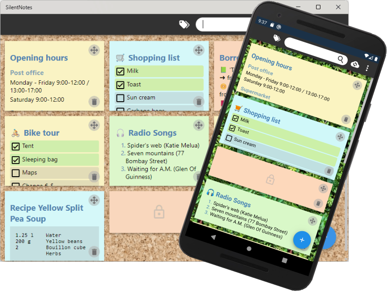

# SilentNotes

SilentNotes is a note taking app which respects your privacy. The notes can be synchronized between Android and Windows devices. SilentNotes uses end-to-end encryption to protect the notes.

More information you can find on [SilentNote's homepage](https://www.martinstoeckli.ch/silentnotes). If you want to help, please read our [contribution guidelines](CONTRIBUTING.md).

## Features

* ✔ Take your notes wherever you are on your Android and Windows devices.
* ✔ Write the notes in an easily operated WYSIWYG editor.
* ✔ Create To-Do lists to keep an overview of your pending tasks.
* ✔ Protect your notes with a user defined password.
* ✔ Quickly find the right note with the full-text search, just by typing a few letters.
* ✔ Organize and filter the notes with a tagging system.
* ✔ Store the notes to an online-storage of your choice (self hosting), this allows to synchronize them between devices and offers an easy backup.
* ✔ Currently supported are the `FTP` protocol, the `WebDav` protocol, `Dropbox`, `Google-Drive` and `One-Drive`.
* ✔ The notes never leave the device unencrypted, they are end-to-end encrypted and can only be read on your devices.
* ✔ A dark theme is available for more comfortable working in dark environment.
* ✔ Use basic formatting to structure your notes and make them more readable.
* ✔ Get a note back from the recycle-bin if it was deleted by accident.
* ✔ SilentNotes does not collect user information and requires no unnecessary privileges.

## Security

Whenever an application promises security and confidentiality, users just have to trust the developer team. Not only is it challenging to do encryption right, users are more and more accustomed to pay with their personal data, to benefit from new technologies. We believe that the best way to build trust is to publish the entire source code, this is why SilentNotes was turned into an open source project.

## Credits

* The [QuillJS](https://quilljs.com/) library made it possible to offer WYSIWYG note editing across platforms.
* Cryptograhic tasks are solved with the [Bouncy Castle](https://bouncycastle.org/) crypto API.
* The clean and minimalistic [Flurl](https://flurl.dev/) library helped a lot to keep the HTTP requests readable.
* A databinding system between C# and the HTML views was developed, using the [vue.js](https://vuejs.org/) framework.
